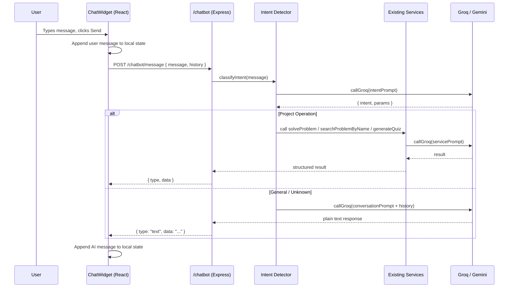

# Design Document: AI Chatbot Assistant

## Overview

The AI Chatbot Assistant adds a floating chat widget to every authenticated page of the app. Users can ask general DSA/programming questions or trigger project operations (fetch a problem approach, search a problem, start a quiz, get PDF help) through natural language. The chatbot maintains a short in-session conversation history so follow-up messages are contextually coherent.

The feature is implemented as:
- A new `/chatbot` route group on the Node.js server following the existing `server/features/{feature}/` pattern
- A floating `ChatWidget` React component rendered globally inside `ProtectedRoute`
- Intent detection via a single AI call that classifies the message and routes it to the appropriate handler

The design reuses all existing infrastructure: `callGroq`/`callGemini` for AI calls, `isAuthenticated` for auth, `aiRateLimiter` for throttling, and the existing AI service functions for project operations.

---

## Architecture

### High-Level Data Flow



### Component Placement

`ChatWidget` is rendered once inside `ProtectedRoute`, wrapping all authenticated children. This ensures it appears on every authenticated route without duplicating it per-page.

```
ProtectedRoute
  └── children (Home, Problems, Quiz, etc.)
  └── ChatWidget   ← rendered alongside children, fixed position
```

---

## Components and Interfaces

### Client-Side

#### `ChatWidget` (`client/src/components/ChatWidget.jsx`)

The single floating UI component. Manages all local state.

**State:**
```js
const [isOpen, setIsOpen]       = useState(false);
const [messages, setMessages]   = useState([]);  // { role: "user"|"ai", content, type, data }
const [input, setInput]         = useState("");
const [isLoading, setIsLoading] = useState(false);
```

**Key behaviors:**
- Renders a fixed `bottom-6 right-6` button at all times
- Toggles `isOpen` on button click; messages are never cleared on toggle
- On submit: validates non-empty/non-whitespace input, appends user message, calls `POST /chatbot/message`, appends AI response
- Renders different message layouts based on `type`: `"text"`, `"approach"`, `"problem"`, `"quiz"`, `"pdf_link"`
- Uses `useRef` + `useEffect` to scroll the message list to the bottom after each update

#### `ChatMessage` (sub-component within ChatWidget)

Renders a single message bubble. Handles:
- `type: "text"` — renders with basic markdown (bold, italic, inline code, line breaks) via a lightweight renderer
- `type: "approach"` — renders title, approach steps as `<ol>`, complexity badge, language tags
- `type: "problem"` — renders title, description, constraints, difficulty badge, tags
- `type: "quiz"` — renders topic, difficulty levels, and a `<button>` that calls `navigate(url)`
- `type: "pdf_link"` — renders a `<button>` that calls `navigate("/documents")`
- `type: "error"` — renders in a red/destructive style

#### API call (`client/src/api/api.jsx` addition)

```js
export const sendChatMessage = (message, history) =>
  axiosInstance.post("/chatbot/message", { message, history });
```

---

### Server-Side

#### Route: `server/features/chatbot/chatbot.routes.js`

```
POST /chatbot/message   isAuthenticated, aiRateLimiter → chatbot.controller.handleMessage
```

#### Controller: `server/features/chatbot/chatbot.controller.js`

`handleMessage(req, res)`:
1. Validates `message` is a non-empty string; returns 400 if not
2. Sanitizes message (strips prompt-injection patterns)
3. Calls `chatbot.service.processMessage(userId, message, history)`
4. Returns the structured response or error

#### Service: `server/features/chatbot/chatbot.service.js`

`processMessage(userId, message, history)`:
1. Calls `detectIntent(message)` → `{ intent, params }`
2. Routes to the appropriate handler based on intent
3. Returns a response object `{ type, data }`

`detectIntent(message)`:
- Calls `callGroq` with a classification prompt
- Returns `{ intent: string, params: object }`
- Valid intents: `fetch_approach`, `search_problem`, `start_quiz`, `upload_pdf_prompt`, `general_question`, `unknown`

**Intent handlers:**

| Intent | Handler | Calls |
|---|---|---|
| `fetch_approach` | `handleFetchApproach(params, history)` | `solveProblem` logic from `ai.service.js` |
| `search_problem` | `handleSearchProblem(params, history)` | `searchProblemByName` logic from `ai.service.js` |
| `start_quiz` | `handleStartQuiz(params)` | Validates topic, builds deep-link URL |
| `upload_pdf_prompt` | `handlePdfPrompt()` | Returns static deep-link response |
| `general_question` / `unknown` | `handleGeneralQuestion(message, history)` | `callGroq` with conversation context |

---

## Data Models

### Message (client-side, in-memory only)

```ts
interface ChatMessage {
  id: string;           // crypto.randomUUID()
  role: "user" | "ai";
  content: string;      // raw text for user messages; summary text for AI
  type: "text" | "approach" | "problem" | "quiz" | "pdf_link" | "error";
  data?: ApproachData | ProblemData | QuizData | null;
  timestamp: number;
}
```

### ApproachData

```ts
interface ApproachData {
  title: string;
  approach: string[];
  complexity: string;
  solutions: { cpp: string; java: string; javascript: string; python: string };
}
```

### ProblemData

```ts
interface ProblemData {
  title: string;
  problem: string;
  constraints: string;
  difficulty: string;
  tags: string[];
}
```

### QuizData

```ts
interface QuizData {
  topic: string;
  levels: string[];
  url: string;          // e.g. "/quiz/arrays" or "/quiz/arrays/medium"
}
```

### API Request / Response

**Request** `POST /chatbot/message`:
```json
{
  "message": "string",
  "history": [
    { "role": "user" | "assistant", "content": "string" }
  ]
}
```

**Response** (success):
```json
{
  "type": "text" | "approach" | "problem" | "quiz" | "pdf_link",
  "content": "string",
  "data": { ... } | null
}
```

**Response** (error):
```json
{
  "error": "string",
  "code": "MISSING_PARAMS" | "SERVICE_ERROR" | "RATE_LIMITED" | "TIMEOUT"
}
```

### Context Window

The client sends the last 10 messages from `messages` state, mapped to `{ role, content }` pairs, with `role: "ai"` mapped to `"assistant"` for the AI provider format. The server does not persist history — it is entirely client-managed.

---

## Intent Detection

### Classification Prompt

The intent detector sends a single structured prompt to Groq:

```
You are an intent classifier for a DSA learning app chatbot.
Classify the user message into exactly one intent.

Valid intents:
- fetch_approach: user wants to get an algorithm approach/solution for a problem
- search_problem: user wants to find/look up a problem by name
- start_quiz: user wants to start or take a quiz
- upload_pdf_prompt: user is asking about PDFs, documents, or resume features
- general_question: general DSA/programming question or anything else
- unknown: completely unrelated or incomprehensible

Extract any relevant params:
- fetch_approach: { "problemName": "..." }
- search_problem: { "problemName": "..." }
- start_quiz: { "topic": "...", "level": "..." | null }
- others: {}

User message: "{message}"

Return ONLY valid JSON: { "intent": "...", "params": { ... } }
```

### Available Quiz Topics

The service maintains a static list of valid topics (matching the existing quiz routes):
`["arrays", "linked-lists", "stacks", "queues", "trees", "graphs", "dynamic-programming", "sorting", "searching", "hashing"]`

If the extracted topic doesn't match, the handler returns a `general_question`-style response listing available topics.

### Fallback Chain

1. `callGroq` for intent detection
2. If Groq fails → `callGemini` (existing fallback utility)
3. If both fail → return `{ intent: "unknown", params: {} }` and handle as general question

---

## Correctness Properties

*A property is a characteristic or behavior that should hold true across all valid executions of a system — essentially, a formal statement about what the system should do. Properties serve as the bridge between human-readable specifications and machine-verifiable correctness guarantees.*

### Property 1: Toggle preserves conversation history

*For any* `ChatWidget` with a non-empty messages array, toggling `isOpen` from true to false and back to true should leave the messages array identical to its state before toggling.

**Validates: Requirements 1.3, 3.3**

---

### Property 2: Non-empty message submission grows the message list

*For any* non-empty, non-whitespace-only input string, submitting it should result in the messages array length increasing by exactly one (the user message) before the API response arrives, and by exactly two after a successful response.

**Validates: Requirements 2.1, 2.3**

---

### Property 3: Whitespace-only messages are rejected

*For any* string composed entirely of whitespace characters (spaces, tabs, newlines), submitting it should leave the messages array unchanged and should not trigger an API call.

**Validates: Requirements 2.4**

---

### Property 4: Context window is capped at 10 messages

*For any* conversation history of length N, the `history` array sent to `POST /chatbot/message` should contain exactly `min(N, 10)` entries, always taking the most recent messages.

**Validates: Requirements 3.1**

---

### Property 5: Intent classification returns a valid intent

*For any* non-empty user message string, the `detectIntent` function should return an object whose `intent` field is one of: `fetch_approach`, `search_problem`, `start_quiz`, `upload_pdf_prompt`, `general_question`, `unknown`.

**Validates: Requirements 4.1**

---

### Property 6: Approach response contains all required fields

*For any* successful `fetch_approach` operation, the response `data` object should contain non-empty values for `title`, `approach` (a non-empty array), `complexity`, and `solutions` (with at least one language key).

**Validates: Requirements 5.2**

---

### Property 7: Problem search response contains all required fields

*For any* successful `search_problem` operation, the response `data` object should contain non-empty values for `title`, `problem`, `constraints`, `difficulty`, and `tags` (an array).

**Validates: Requirements 6.2**

---

### Property 8: Quiz response contains topic, levels, and a valid URL

*For any* `start_quiz` intent with a recognized topic, the response `data` object should contain a non-empty `topic`, a non-empty `levels` array, and a `url` string that starts with `/quiz/`.

**Validates: Requirements 7.1**

---

### Property 9: Message sanitization removes prompt injection patterns

*For any* user message containing prompt injection patterns (e.g., "ignore previous instructions", "system:", role-override attempts), the sanitized version passed to the AI prompt should not contain those patterns verbatim.

**Validates: Requirements 10.4**

---

### Property 10: Error responses preserve existing chat history

*For any* `ChatWidget` state with N messages, when the API call returns a 4xx or 5xx error, the messages array should still contain the original N messages plus the user's message (N+1), and the error should be appended as an additional AI error message rather than replacing existing history.

**Validates: Requirements 12.4**

---

## Error Handling

### Server-Side

| Scenario | HTTP Status | Response |
|---|---|---|
| Missing or empty `message` field | 400 | `{ error: "Message is required" }` |
| Unauthenticated request | 401 | `{ message: "User not authenticated" }` (from `isAuthenticated`) |
| Rate limit exceeded | 429 | `{ error: "Too many AI requests...", retryAfter }` (from `aiRateLimiter`) |
| Missing params for project operation | 200 | `{ type: "text", content: "clarifying question..." }` |
| AI provider timeout (>30s) | 504 | `{ error: "AI service temporarily unavailable", code: "TIMEOUT" }` |
| AI provider quota exceeded | 200 (after fallback) or 503 | Falls back to Gemini; if all fail: `{ error: "...", code: "SERVICE_ERROR" }` |
| Unknown intent with no fallback | 200 | `{ type: "text", content: "I'm not sure how to help with that..." }` |

### Client-Side

- On any non-2xx response: append an `{ role: "ai", type: "error", content: error.message }` message to the chat
- Re-enable the input field and hide the loading indicator
- Never clear existing messages on error
- Network timeout: treat as a generic error after 35 seconds (5s buffer over server timeout)

---

## Testing Strategy

### Unit Tests

Focus on specific examples, edge cases, and error conditions:

- `detectIntent` returns `unknown` for gibberish input
- `handleStartQuiz` returns available topics list when topic is unrecognized
- `handleFetchApproach` returns user-friendly error when the AI service throws
- `sanitizeMessage` strips known injection patterns
- Context window slicing: history of 15 messages → only last 10 sent
- `ChatWidget` does not call the API when input is whitespace-only
- `ChatWidget` renders error message when API returns 500

### Property-Based Tests

Use **fast-check** (JavaScript) for both client and server property tests. Each test runs a minimum of **100 iterations**.

**Property 1: Toggle preserves conversation history**
```
// Feature: ai-chatbot-assistant, Property 1: Toggle preserves conversation history
fc.property(fc.array(messageArbitrary, { minLength: 1 }), (messages) => {
  // render ChatWidget with messages, toggle open→closed→open, assert messages unchanged
})
```

**Property 2: Non-empty message grows message list**
```
// Feature: ai-chatbot-assistant, Property 2: Non-empty message submission grows the message list
fc.property(fc.string({ minLength: 1 }).filter(s => s.trim().length > 0), async (input) => {
  // submit input, assert messages.length increased by 1 before response
})
```

**Property 3: Whitespace-only messages are rejected**
```
// Feature: ai-chatbot-assistant, Property 3: Whitespace-only messages are rejected
fc.property(fc.stringOf(fc.constantFrom(' ', '\t', '\n'), { minLength: 1 }), (input) => {
  // attempt submit, assert no API call made, messages unchanged
})
```

**Property 4: Context window capped at 10**
```
// Feature: ai-chatbot-assistant, Property 4: Context window is capped at 10 messages
fc.property(fc.array(messageArbitrary, { minLength: 0, maxLength: 30 }), (history) => {
  const sent = buildContextWindow(history);
  assert(sent.length === Math.min(history.length, 10));
  assert(deepEqual(sent, history.slice(-10)));
})
```

**Property 5: Intent classification returns valid intent**
```
// Feature: ai-chatbot-assistant, Property 5: Intent classification returns a valid intent
fc.property(fc.string({ minLength: 1 }), async (message) => {
  const { intent } = await detectIntent(message);
  assert(VALID_INTENTS.includes(intent));
})
```

**Property 6: Approach response contains all required fields**
```
// Feature: ai-chatbot-assistant, Property 6: Approach response contains all required fields
fc.property(approachResultArbitrary, (result) => {
  const formatted = formatApproachResponse(result);
  assert(formatted.data.title && formatted.data.approach.length > 0 && formatted.data.complexity);
})
```

**Property 7: Problem search response contains all required fields**
```
// Feature: ai-chatbot-assistant, Property 7: Problem search response contains all required fields
fc.property(problemResultArbitrary, (result) => {
  const formatted = formatProblemResponse(result);
  assert(formatted.data.title && formatted.data.problem && formatted.data.difficulty);
})
```

**Property 8: Quiz response contains topic, levels, and valid URL**
```
// Feature: ai-chatbot-assistant, Property 8: Quiz response contains topic, levels, and a valid URL
fc.property(fc.constantFrom(...VALID_TOPICS), (topic) => {
  const response = buildQuizResponse(topic, null);
  assert(response.data.url.startsWith("/quiz/"));
  assert(response.data.levels.length > 0);
})
```

**Property 9: Sanitization removes injection patterns**
```
// Feature: ai-chatbot-assistant, Property 9: Message sanitization removes prompt injection patterns
fc.property(injectionArbitrary, (maliciousInput) => {
  const sanitized = sanitizeMessage(maliciousInput);
  INJECTION_PATTERNS.forEach(pattern => assert(!sanitized.match(pattern)));
})
```

**Property 10: Error responses preserve existing chat history**
```
// Feature: ai-chatbot-assistant, Property 10: Error responses preserve existing chat history
fc.property(fc.array(messageArbitrary), fc.string({ minLength: 1 }), async (existingMessages, input) => {
  // mock API to return 500, submit message
  // assert first existingMessages.length + 1 messages are unchanged
  // assert last message is an error message
})
```
